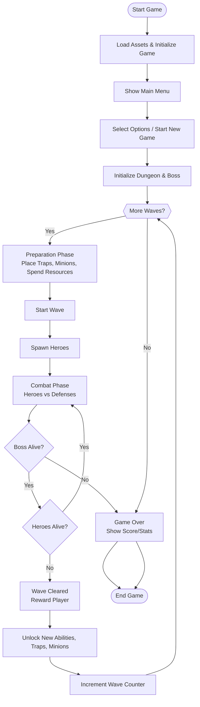

```mermaid
flowchart TD
    Start([Start Game])
    LoadAssets[Load Assets & Initialize Game]
    MainMenu[Show Main Menu]
    SelectOptions[Select Options / Start New Game]
    InitDungeon[Initialize Dungeon & Boss]
    WaveLoop{{More Waves?}}
    Prepare[Preparation Phase\nPlace Traps, Minions, Spend Resources]
    StartWave[Start Wave]
    SpawnHeroes[Spawn Heroes]
    Combat[Combat Phase\nHeroes vs Defenses]
    CheckBossAlive{Boss Alive?}
    CheckHeroesAlive{Heroes Alive?}
    WinWave[Wave Cleared\nReward Player]
    NextWave[Increment Wave Counter]
    GameOver[Game Over\nShow Score/Stats]
    Unlocks[Unlock New Abilities, Traps, Minions]
    End([End Game])

    Start --> LoadAssets --> MainMenu --> SelectOptions --> InitDungeon --> WaveLoop
    WaveLoop -- Yes --> Prepare --> StartWave --> SpawnHeroes --> Combat
    Combat --> CheckBossAlive
    CheckBossAlive -- No --> GameOver --> End
    CheckBossAlive -- Yes --> CheckHeroesAlive
    CheckHeroesAlive -- No --> WinWave --> Unlocks --> NextWave --> WaveLoop
    CheckHeroesAlive -- Yes --> Combat
    WaveLoop -- No --> GameOver --> End
```