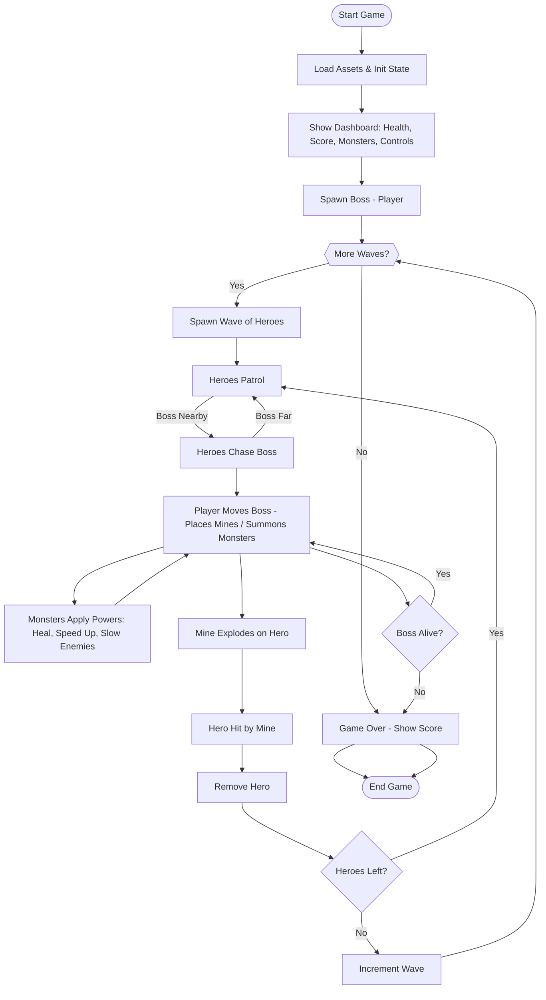

```mermaid
flowchart TD
    Start([Start Game])
    LoadAssets[Load Assets & Init State]
    ShowDashboard[Show Dashboard: Health, Score, Monsters, Controls]
    SpawnBoss[Spawn Boss - Player]
    WaveLoop{{More Waves?}}
    SpawnWave[Spawn Wave of Heroes]
    HeroPatrol[Heroes Patrol]
    HeroChase[Heroes Chase Boss]
    PlayerActions[Player Moves Boss - Places Mines / Summons Monsters]
    MonsterPowers[Monsters Apply Powers: Heal, Speed Up, Slow Enemies]
    MineExplode[Mine Explodes on Hero]
    HeroHit[Hero Hit by Mine]
    RemoveHero[Remove Hero]
    CheckBossAlive{Boss Alive?}
    CheckHeroesAlive{Heroes Left?}
    NextWave[Increment Wave]
    GameOver[Game Over - Show Score]
    End([End Game])

    Start --> LoadAssets --> ShowDashboard --> SpawnBoss --> WaveLoop
    WaveLoop -- Yes --> SpawnWave --> HeroPatrol
    HeroPatrol -->|Boss Nearby| HeroChase
    HeroChase -->|Boss Far| HeroPatrol
    HeroChase --> PlayerActions
    PlayerActions --> MonsterPowers
    PlayerActions --> MineExplode
    MonsterPowers --> PlayerActions
    MineExplode --> HeroHit --> RemoveHero --> CheckHeroesAlive
    CheckHeroesAlive -- Yes --> HeroPatrol
    CheckHeroesAlive -- No --> NextWave --> WaveLoop
    WaveLoop -- No --> GameOver --> End
    PlayerActions --> CheckBossAlive
    CheckBossAlive -- No --> GameOver --> End
    CheckBossAlive -- Yes --> PlayerActions
```