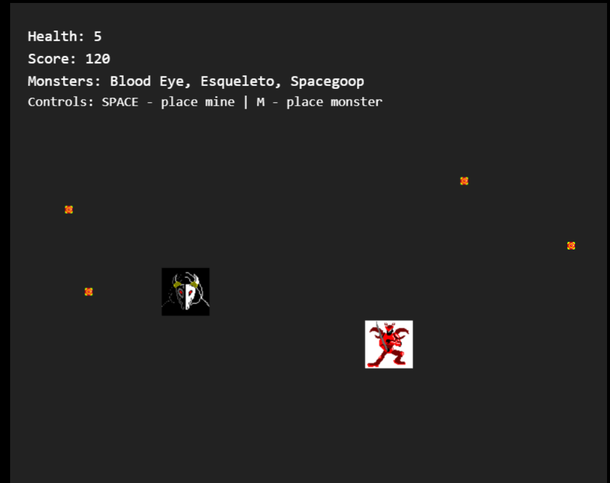

# Reverse Dungeon

## 🖼️ Game Screenshot



A dungeon defense game where you play as the final boss, defending your territory against invading heroes.

## 🎮 Description

Reverse Dungeon is a strategy and defense game where the player controls the final boss of a dungeon. The goal is to defend the dungeon against waves of invading heroes, using traps, minions, and special abilities.

## 🛠️ Technologies Used

- HTML5
- CSS3
- JavaScript (ES6+)
- Phaser.js 3.70.0
- Vite (bundler)

## 📁 Project Structure

```
/ReverseDungeon
├── index.html
├── assets/
│   ├── images/
│   ├── sounds/
│   └── sprites/
├── src/
│   ├── js/
│   │   ├── game.js
│   │   ├── scenes/
│   │   ├── entities/
│   │   └── utils/
│   └── css/
│       └── style.css
└── package.json
```

## 🚀 Getting Started

1. Install dependencies:
```bash
npm install
```

2. Start the development server:
```bash
npm run dev
```

3. To build the project:
```bash
npm run build
```

4. To preview the production build:
```bash
npm run preview
```

## 🎯 Features

- Combat system
- Dungeon defense system
- Resource system
- Enemy system
- Progression system
- Power-up system

## 🎨 Visual Style

- Pixel Art
- Resolution: 800x600
- Retro visual style

## 🎮 Game Mechanics

- Control the final boss
- Defend the dungeon against invading heroes
- Place traps and minions
- Resource system for building defenses
- Different types of heroes with unique abilities
- Wave-based attack system

## 🎯 Game Objectives

- Defend the dungeon against waves of heroes
- Manage resources efficiently
- Unlock new abilities and defenses
- Survive as many waves as possible

## 🤝 Contributing

Contributions are welcome! Please read the contribution guide before submitting a pull request.

## 📝 License

This project is licensed under the MIT License - see the LICENSE file for details.
