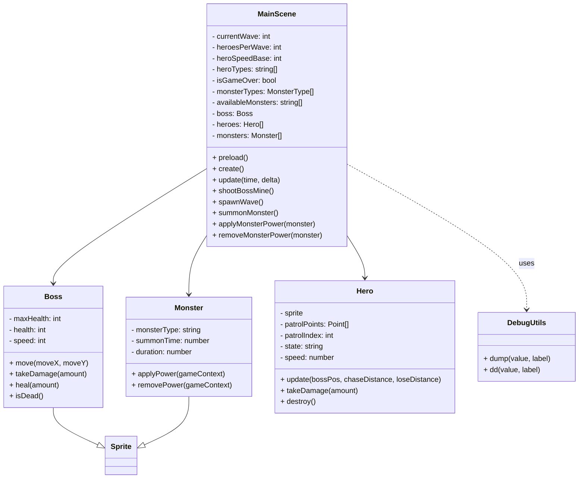

```mermaid
classDiagram
    class MainScene {
        - currentWave: int
        - heroesPerWave: int
        - heroSpeedBase: int
        - heroTypes: string[]
        - isGameOver: bool
        - monsterTypes: MonsterType[]
        - availableMonsters: string[]
        - boss: Boss
        - heroes: Hero[]
        - monsters: Monster[]
        + preload()
        + create()
        + update(time, delta)
        + shootBossMine()
        + spawnWave()
        + summonMonster()
        + applyMonsterPower(monster)
        + removeMonsterPower(monster)
    }
    class Boss {
        - maxHealth: int
        - health: int
        - speed: int
        + move(moveX, moveY)
        + takeDamage(amount)
        + heal(amount)
        + isDead()
    }
    class Monster {
        - monsterType: string
        - summonTime: number
        - duration: number
        + applyPower(gameContext)
        + removePower(gameContext)
    }
    class Hero {
        - sprite
        - patrolPoints: Point[]
        - patrolIndex: int
        - state: string
        - speed: number
        + update(bossPos, chaseDistance, loseDistance)
        + takeDamage(amount)
        + destroy()
    }
    class DebugUtils {
        + dump(value, label)
        + dd(value, label)
    }
    MainScene --> Boss
    MainScene --> Hero
    MainScene --> Monster
    MainScene ..> DebugUtils : uses
    Boss --|> Sprite
    Monster --|> Sprite
```