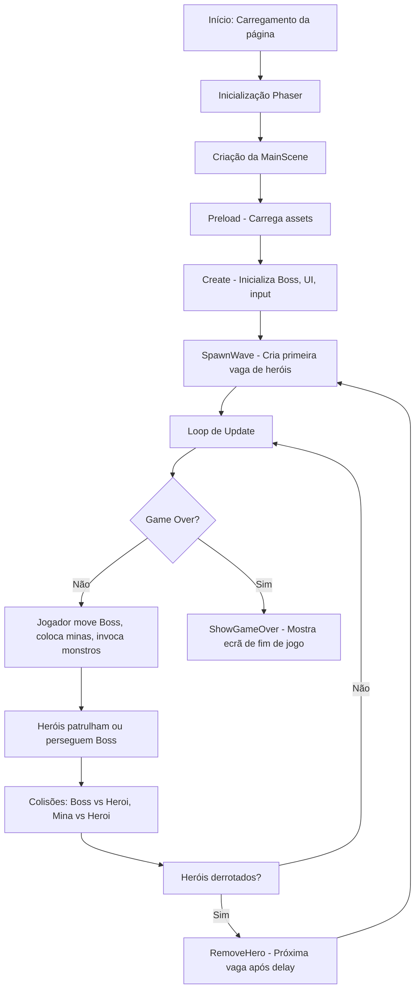

```mermaid
flowchart TD
    A[Início: Carregamento da página] --> B[Inicialização Phaser]
    B --> C[Criação da MainScene]
    C --> D[Preload - Carrega assets]
    D --> E[Create - Inicializa Boss, UI, input]
    E --> F[SpawnWave - Cria primeira vaga de heróis]
    F --> G[Loop de Update]
    G --> H{Game Over?}
    H -- Não --> I[Jogador move Boss, coloca minas, invoca monstros]
    I --> J[Heróis patrulham ou perseguem Boss]
    J --> K[Colisões: Boss vs Heroi, Mina vs Heroi]
    K --> L[Heróis derrotados?]
    L -- Sim --> M[RemoveHero - Próxima vaga após delay]
    M --> F
    L -- Não --> G
    H -- Sim --> N[ShowGameOver - Mostra ecrã de fim de jogo]
```