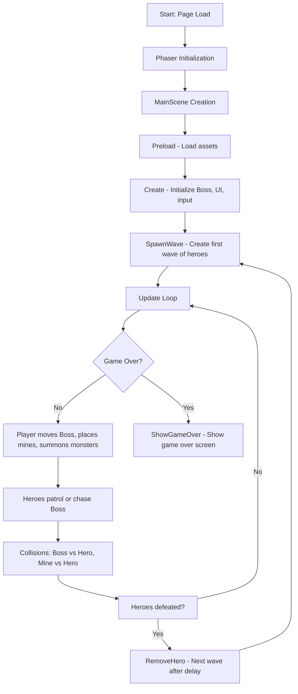

```mermaid
flowchart TD
    A[Start: Page Load] --> B[Phaser Initialization]
    B --> C[MainScene Creation]
    C --> D[Preload - Load assets]
    D --> E[Create - Initialize Boss, UI, input]
    E --> F[SpawnWave - Create first wave of heroes]
    F --> G[Update Loop]
    G --> H{Game Over?}
    H -- No --> I[Player moves Boss, places mines, summons monsters]
    I --> J[Heroes patrol or chase Boss]
    J --> K[Collisions: Boss vs Hero, Mine vs Hero]
    K --> L[Heroes defeated?]
    L -- Yes --> M[RemoveHero - Next wave after delay]
    M --> F
    L -- No --> G
    H -- Yes --> N[ShowGameOver - Show game over screen]
```